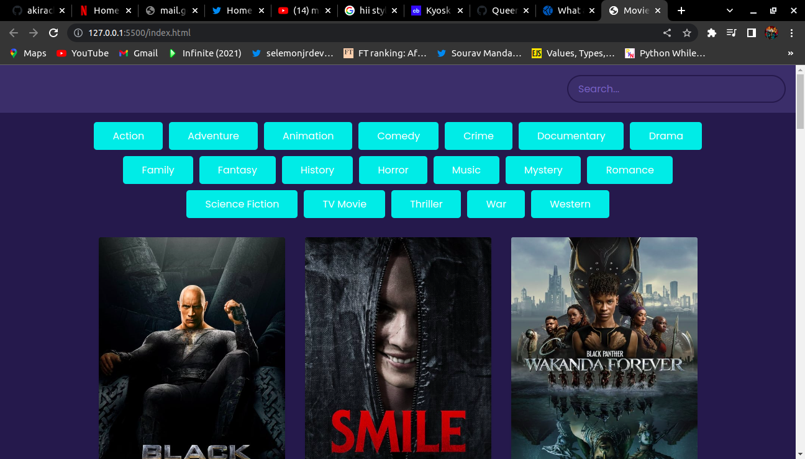
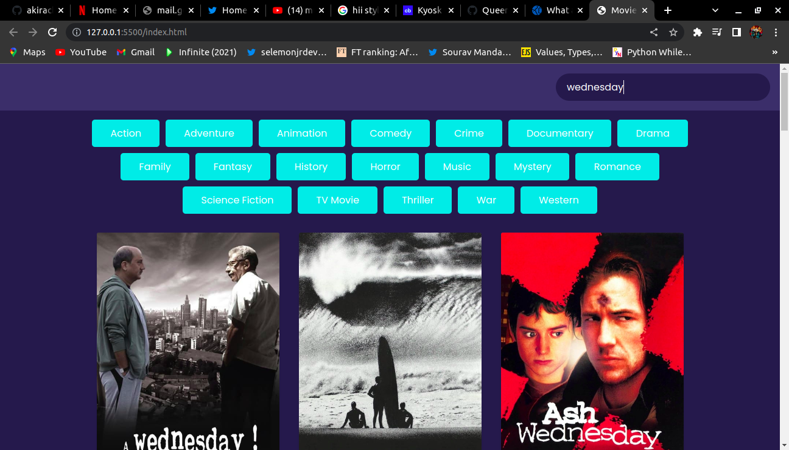
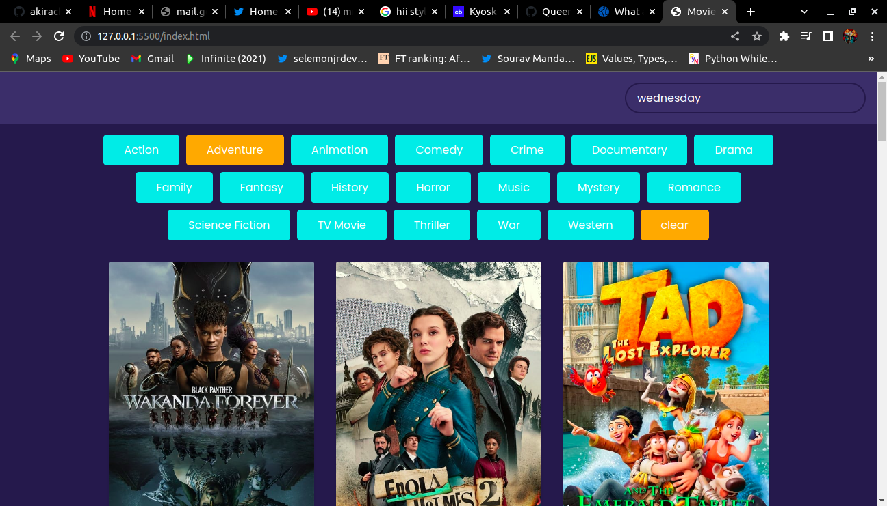

# Movie App
## Author
Quienzy Ong'eye
## Description
Its a PWA application that enables a user to go through some of the latest movie preview. One is able to search and surf through different genres that matches their preferences.

### Prerequisites
You need to have git installed
You can install it with the following command in your terminal
`$ sudo apt-get install git`
### Setup
To access this project on your local files, you can clone it using these steps
1. Open your terminal
1. Use this command to clone `$ git clone https://github.com/Queenzy-Ongeye/Movie-App.git`
1. This will clone the repository to your local folder
### Technologies used.
1. HTML
1. CSS
1. BOOTSTRAP
1. JAVASCRIPT
### Live Site
View [Live] (https://queenzy-movie-app.netlify.app/)
### Licence
This project is under the  [MIT](license) license